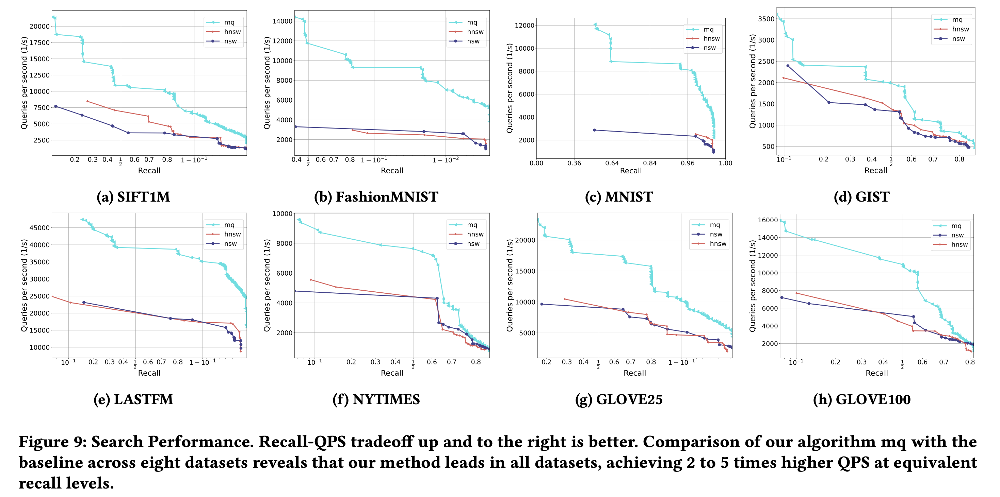
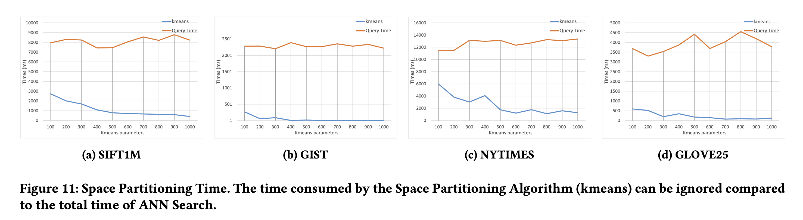

# Efficient Graph-based Multi-Query for Approximate Nearest Neighbor Searching

**Efficient Graph-based Multi-Query for Approximate Nearest Neighbor Searching** is a paper we submitted to ICDE2025. We first proposed the multi-query problem in ANN and put forward the theory of Spatial Locality for this problem. Through this theory, we can effectively improve the speed and recall of ANN multi-query problems.

We designed a graph algorithm-based framework for Spatial Locality, which has low intrusion and supports hot-swapping features, so it can be quickly applied to various graph algorithm projects. This code is our experimental code in the paper. Based on hnswlib, we implemented our code framework. By conducting experiments on eight real-world classic datasets, we found that by using Spatial Locality, query time can be effectively reduced by 50%~80%.


# Result





# How To Use

We conducted experiments on a total of eight datasets.

| Dataset       | Dimensions | Train Size | Test Size | Distance  |
| ------------- | ---------- | ---------- | --------- | --------- |
| Fashion-MNIST | 784        | 60,000     | 10,000    | Euclidean |
| GIST          | 960        | 1,000,000  | 1,000     | Euclidean |
| MNIST         | 784        | 60,000     | 10,000    | Euclidean |
| SIFT1M        | 128        | 1,000,000  | 10,000    | Euclidean |
| GloVe25       | 25         | 1,183,514  | 10,000    | Angular   |
| GloVe100      | 100        | 1,183,514  | 10,000    | Angular   |
| NYTimes       | 256        | 290,000    | 10,000    | Angular   |
| Last.fm       | 65         | 292,385    | 50,000    | Angular   |

The download link for SIFT1M is available. http://corpus-texmex.irisa.fr/

The remaining seven datasets can be downloaded at [ann-benchmarks](https://github.com/erikbern/ann-benchmarks?tab=readme-ov-file#data-sets)

## clone repository

```shell
cd ~
git clone https://github.com/yqylh/GraphAnnLib.git
cd GraphAnnLib
```

### Download DATASET

Configure the dataset you downloaded in `lib/Config.cpp`. All configuration files for this project are located in this file. For the SIFT dataset, you need to provide the locations of `sift_base`, `sift_query`, and `sift_groundtruth`. For other datasets, you only need to provide the location of `baseFileName=HDF5`.

## Install hdf5

We used libhdf5-dev to provide access to HDF5 files for reading, and our compilation options are:

```shell
g++ hnsw.cpp -o mq -g -std=c++17 -O3 -DDatabaseSelect=$datasetS -DTEST -DZERO -DCLUSTER -fopenmp -pthread -w \
    -I /usr/include/hdf5/serial \
    -I ./res/hdf5/HighFive/include/ \
    -lhdf5_cpp -lhdf5 -L /usr/lib/x86_64-linux-gnu/hdf5/serial

```

Please make sure that there are corresponding static and dynamic link libraries in `/usr/include/hdf5/serial` and `/usr/lib/x86_64-linux-gnu/hdf5/serial`.

One available installation method that depends on HDF5 is:

```shell
sudo apt-get install libhdf5-dev
```

You can use the following command to determine if your installation location is correct.

```shell
sudo find /usr -name H5Cpp.h
sudo find /usr -name libhdf5.so
whereis hdf5
```

# Reproduce Experiment

You can use `runMQ.sh runHNSW.sh runNSW.sh` to obtain the experimental results of our search performance. Note that this may require hundreds of gigabytes of memory, and we recommend at least 64Core/128Thread CPU. Also, it may take several days to complete the results. (You may need to redirect output to record the results.)

You can use `runTime.sh` to obtain our experimental results on space partitioning.

If you need to draw graphs, we provide a streamlined version of plotting tool in `res/ann-benchmarks/plot.py`, which includes post-processing code for outputting results specific to this project.

# Reference

The code for `res/kmeans` comes from the project [kmeans](https://github.com/felixduvallet/kmeans.git). We have made modifications to it and used it under the **BSD-3-Clause** license. We have kept its original README and license.

The code for `res/hnswlib` comes from the project [hnswlib](https://github.com/nmslib/hnswlib). We have made modifications to it and used it under the **Apache-2.0** license. We have kept its original README and license.

The code for `res/hdf5` comes from the project [HighFive](https://github.com/BlueBrain/HighFive). We have made modifications to it and used it under the **BSL-1.0** license. We have kept its original README, VERSION, CHANGELOG, and license.

The code for `res/ann-benchmarks` comes from the project [ann-benchmarks](https://github.com/erikbern/ann-benchmarks). We have made modifications to it and used it under the **MIT** license. We have kept its original README and license.
